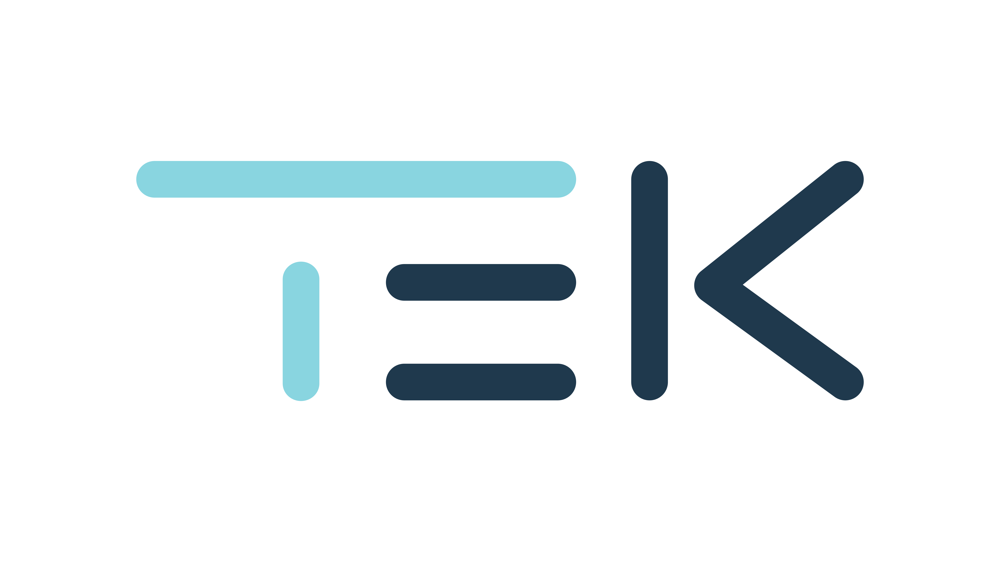

<!-- Your page content goes here -->

<h1> Deripaatti 2024 </h1>

    
    

<b>Ohoi!</b> 
Rakkaat SFMO:n jäsenjärjestöt, nyt se on varmaa. Pitkään odotettu <b>Deripaatti 2024</b> järjestetään 22.3.–23.3. Tallinkin M/S Victoria I laivalla. Tämä 22 tuntia kestävä spektaakkeli kerää yhteen kaikki fysiikan ja matematiikan opiskelijat ympäri Suomen unohtumattoman meriseikkailun pariin.
  
<h1><b>Risteilyaikataulu:</b></h1>
<b>22.3.</b>
<li>Lähtö 18.35 <b>Helsinki</b> (Länsiterminaali 2)</li>
<b>23.3.</b>
<li>Ostokset Tallinnassa 8.00–12.00</li>
<li>Lähtö 12.30 <b>Tallinnasta</b></li>
<li>Paluu 16.00 <b>Helsinkiin</b></li>
 
<h1> Illan pääesintyjä <b><a href="https://open.spotify.com/artist/3iF1ik49IHY72yBodxN9ec?si=oKoOc-9LQFeaC2Y7JR906Q">BESS</a></b> </h1>
<h1><b>Mitä tarvitset mukaan:</b></h1>
<li>Henkilöllisyystodistuksen
<li>Haalarit
<li>Juhlamieltä
  
Laivakohtaisen infon löydät osoitteesta <a href="https://fi.tallink.com/victoria">Tallink Silja</a>
